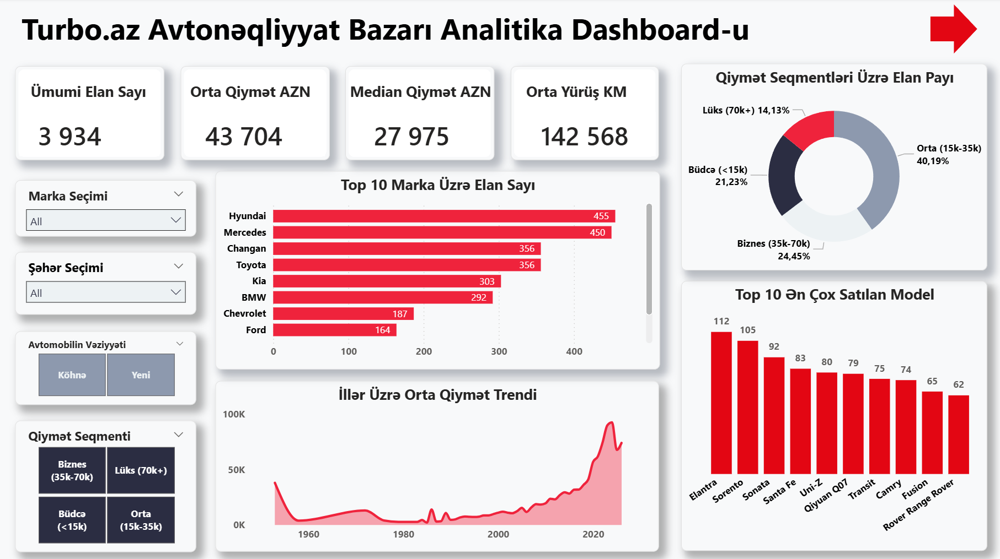
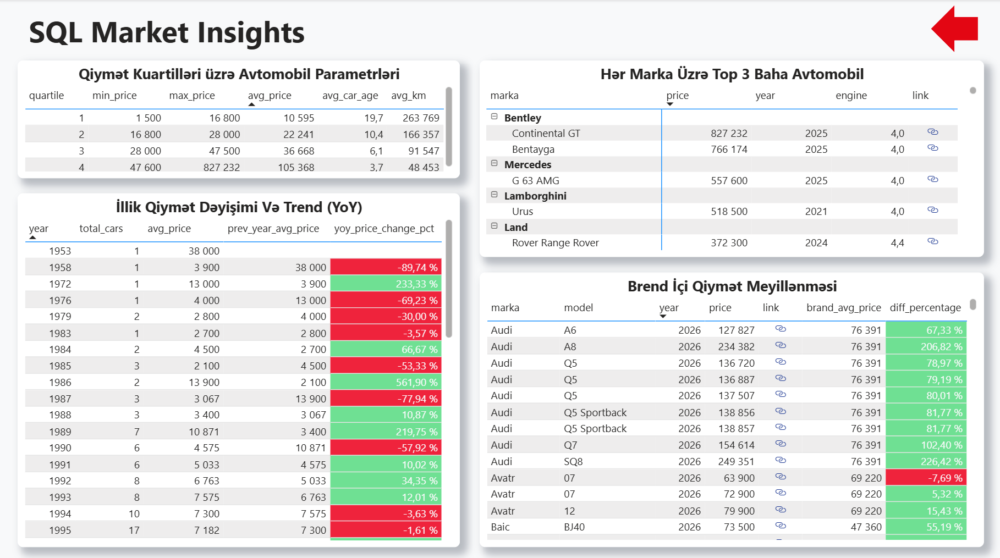

# 🚗 Turbo.az Auto Market Analysis (End-to-End Data Project)

An end-to-end data analytics project exploring the Azerbaijani automobile market using real-time scraped data from Turbo.az. The project covers the full data lifecycle: Web Scraping, Data Cleaning, Relational Database Analytics, and Interactive Power BI Dashboards.

---

## 📌 Project Architecture & Workflow

1. **Data Extraction & Cleaning (Python):** Scraped automobile listings using BeautifulSoup, processed and structured the dataset with Pandas and NumPy.
2. **Database Analytics & ETL (PostgreSQL):** Imported clean datasets into PostgreSQL and engineered SQL Views using Advanced Window Functions (`ROW_NUMBER`, `AVG OVER`, `LAG`, `NTILE`).
3. **Interactive Visualization (Power BI):** Developed a multi-page interactive analytics report featuring DAX measures, custom page navigation, dynamic slicers, and URL cross-linking.

---

## 🛠️ Tech Stack

* **Python:** `Pandas`, `NumPy`, `BeautifulSoup` Jupyter Notebook
* **Database:** PostgreSQL, pgAdmin 4
* **SQL Techniques:** CTEs, Window Functions, Custom Aggregations, Views
* **BI & Analytics:** Power BI Desktop (DAX, Data Modeling, UI/UX Navigation)

---

## 📊 Key Business Insights

* **Price Quartile Correlation:** Identified strong inverse relationships between vehicle price quartiles ($Q1-Q4$), average age, and mileage (higher price quartiles correlate directly with newer vehicle ages and significantly lower mileage).
* **Brand Price Deviation:** Built real-time market benchmark calculations to evaluate individual listing price variance against brand-level average prices.
* **Year-over-Year (YoY) Trends:** Tracked historical market pricing fluctuations across manufacturing years.

---

## 🖼️ Dashboard Preview

### Page 1: Market Overview (`Bazar İcmalı`)

### Page 2: SQL Market Insights (`SQL Və Dərin Analitika`)

---

## 📁 Repository Structure

turboaz-car-market-analysis/
├── data/
│   └── turboaz_cars_data.csv                  # Raw & cleaned datasets
├── notebooks/
│   └── turboaz_scraping_and_cleaning.ipynb    # Python ETL scripts
├── sql/
│   ├── vw_top_3_cars_per_brand.sql            # Top 3 listings per brand
│   ├── vw_brand_price_deviation.sql          # Brand price variance analysis
│   ├── vw_yoy_price_trends.sql                # YoY price change calculations
│   └── vw_price_quartiles.sql                 # Price quartile analytics
├── dashboard/
│   └── turboaz_auto_market_dashboard.pbix     # Interactive Power BI report
├── images/
│   ├── page1.png                              # Overview dashboard screenshot
│   └── page2.png                              # SQL insights screenshot
├── .gitignore
├── LICENSE
└── README.md

## 👤 Author

**Nihat Rzaquluzade | Junior Data Analyst**

This project was developed as a professional **Data Analytics portfolio project**, demonstrating skills in Python, PostgreSQL, ETL processes, data cleaning, SQL analysis, and Power BI data visualization.

